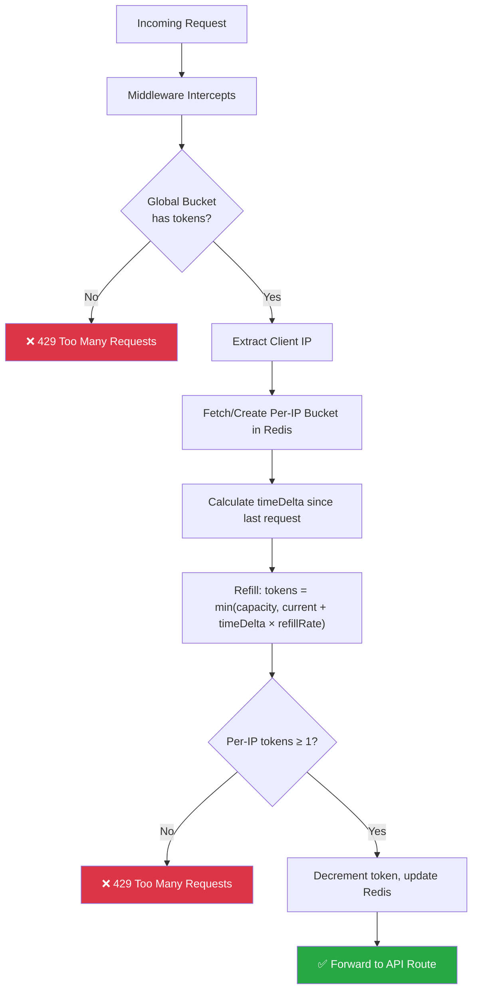

# Distributed API Rate Limiter (Token Bucket)

A high-performance, stateless API Gateway middleware built with **Node.js** and **Redis**, implementing a dual-layer rate-limiting strategy to protect backend services from traffic spikes, abusive clients, and resource exhaustion.

----


## 📌 Overview

Most rate limiters either block too aggressively (hurting legitimate bursty traffic) or leave the whole server exposed to abuse from a single bad actor. This project solves both problems with a **two-tier Token Bucket design** — one bucket protecting the server as a whole, and one bucket per client — synchronized through Redis so the limiter works correctly even across multiple horizontally-scaled server instances.

---

## 🚀 Key Features

| Feature | Description |
|---|---|
| **Token Bucket Algorithm** | Naturally supports bursty traffic instead of rigid fixed windows |
| **Dual-Layer Defense** | Global bucket (protects total server capacity) + per-IP bucket (fair per-client allocation) |
| **Distributed Synchronization** | Redis as a shared state store — works correctly across multiple server instances |
| **Lazy Refill** | Tokens are recalculated on-the-fly from timestamps — no cron jobs, no background polling |
| **Fail-Open Design** | If Redis is slow/unavailable, requests are allowed through rather than blocking all traffic |
| **Horizontally Scalable** | Stateless middleware — safe to run behind a load balancer across N instances |

---

## 🏗️ Architecture & Request Lifecycle



**Step-by-step:**
1. **Middleware entry** — every incoming request is intercepted before reaching the API route.
2. **Global check** — the global token bucket is checked first; if it's empty, the request is rejected immediately, before any per-user lookup, to save Redis calls and CPU under load.
3. **Client identification** — the requester's IP is extracted and used as the key for their individual bucket in Redis.
4. **Token calculation (lazy refill)** — rather than running a background job to top up every bucket on a timer, tokens are computed at request time based on elapsed time:

   $$tokens = \min(\text{capacity}, \text{currentTokens} + (\text{timeDelta} \times \text{refillRate}))$$

5. **Consumption** — if the per-IP bucket has ≥ 1 token, it's decremented and the request proceeds; otherwise the client receives `429 Too Many Requests`.

### Why lazy refill instead of a cron job?
Computing the refill amount at request time (based on `now - lastRequestTimestamp`) means there's no need for a scheduler ticking every bucket in the background. This keeps the system **memory-efficient and CPU-idle** when there's no traffic, and scales naturally since work is only done when a request actually arrives.

---

## ⚙️ Tech Stack

- **Runtime:** Node.js (v14+)
- **Middleware Framework:** Express.js
- **State Store:** Redis
- **Language:** TypeScript

---

## 📋 Prerequisites

- **Node.js** (v14 or higher)
- **Docker Desktop** (to run the Redis instance locally)
- **Postman** or `curl` (for testing endpoints)

---

## ⚙️ Setup & Installation

1. **Clone the repository**
   ```bash
   git clone https://github.com/GautamLodha/API_RATE_LIMITER_GATEWAY.git
   cd API_RATE_LIMITER_GATEWAY
   ```

2. **Install dependencies**
   ```bash
   npm install
   ```

3. **Start Redis** (via Docker)
   ```bash
   docker run -d -p 6379:6379 redis
   ```

4. **Configure environment variables**

   Create a `.env` file in the project root:
   ```env
   REDIS_URL=redis://localhost:6379
   GLOBAL_CAPACITY=1000
   GLOBAL_REFILL_RATE=100
   USER_CAPACITY=20
   USER_REFILL_RATE=5
   PORT=3000
   ```

5. **Run the server**
   ```bash
   npm run dev
   ```

6. **Test it**
   ```bash
   curl -i http://localhost:3000/api/your-route
   ```
   Repeat rapidly (or use a tool like `autocannon`/`k6`) to see `429` responses kick in once the bucket is exhausted.

---

## 🔒 Design Considerations

- **Atomicity under concurrency:** Redis operations (`GET`/`SET` on token counts) can race under very high concurrency if not wrapped carefully. See *Future Enhancements* below — moving this logic into a Lua script closes this gap completely.
- **Fail-open over fail-closed:** If Redis becomes unreachable, the middleware is designed to let requests through rather than block all traffic — prioritizing availability over strict enforcement during infrastructure issues. This is a deliberate tradeoff; flip it to fail-closed if strict enforcement matters more than uptime for your use case.
- **IP-based identification:** Using IP as the bucket key is simple and works well for anonymous traffic, but can be unfair behind shared NATs/proxies. Swapping to an API-key or user-ID based key is straightforward if you have authenticated clients.

---

## 🚀 Future Enhancements

- **Lua Scripting** — move the check-and-decrement logic into a single Redis Lua script (`EVAL`) to guarantee full atomicity and eliminate any race-condition window during high-concurrency spikes.
- **Dynamic Tiering** — integrate with a database to assign different `USER_CAPACITY` / `USER_REFILL_RATE` values per subscription tier (Free vs. Premium).
- **Real-Time Dashboard** — a monitoring UI visualizing blocked IPs, global traffic trends, and current bucket states.
- **Sliding-window fallback metrics** — expose Prometheus-style metrics (requests allowed/blocked per second) for observability.

---

