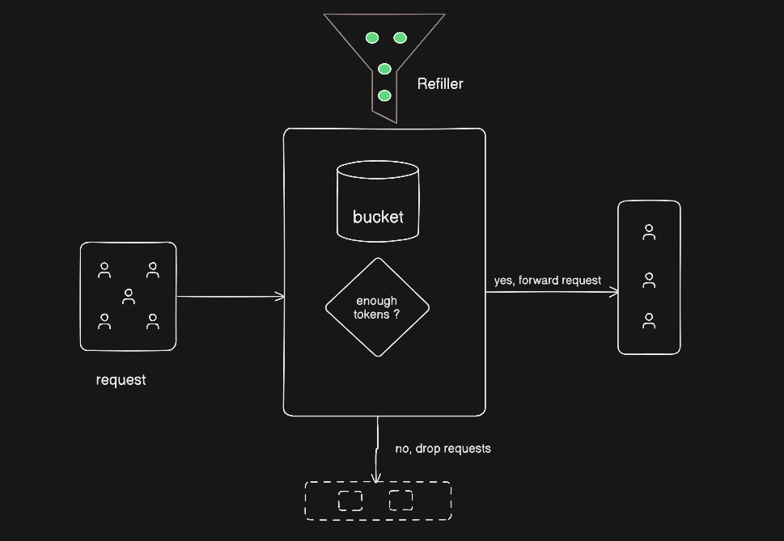

# Distributed API Rate Limiter (Token Bucket)

A high-performance, stateless API Gateway middleware built with **Node.js** and **Redis**. This project implements a dual-layer rate-limiting strategy designed to protect backend services from traffic spikes, DDoS attempts, and resource exhaustion.

## 🚀 Key Features
- **Token Bucket Algorithm:** Optimized to support bursty traffic patterns common in modern web applications.
- **Dual-Layer Defense:** 
  - **Global Bucket:** Prevents total server overload by limiting aggregate traffic.
  - **Per-IP Bucket:** Ensures fair resource allocation and prevents individual user abuse.
- **Distributed Synchronization:** Uses **Redis** as a central state store, allowing the limiter to work across multiple server instances (horizontally scalable).
- **Atomic Operations:** Designed to prevent race conditions during high-concurrency token consumption.
- **Fail-Open Design:** Includes error handling to ensure API availability even if the Redis layer encounters latency or downtime.

## 🛠️ Architecture & Logic

### Request Lifecycle
1. **Middleware Entry**: Every incoming request is intercepted.
2. **Global Check**: The Global Token Bucket is updated. If empty, the request is rejected immediately to save server resources.
3. **User Identification**: The IP address is extracted and used to look up the specific User Token Bucket in Redis.
4. **Token Calculation**:
   - Calculate `timeDelta` since the last request.
   - Refill tokens: $tokens = \min(Capacity, currentTokens + (timeDelta \times refillRate))$
5. **Consumption**: If tokens > 1, decrement and proceed to the API route. Otherwise, return `429`.

### Why this Formula?
By calculating the refill "on-the-fly" based on the timestamp, we avoid the need for heavy background cron jobs or constant polling. This "Lazy Evaluation" strategy makes the system highly performant and memory-efficient.

## 🚀 Future Enhancements
- **Lua Scripting**: Move the logic into a Redis Lua script to ensure 100% atomicity during high-concurrency spikes.
- **Dynamic Tiering**: Integrate with a database to provide different `USER_CAPACITY` based on subscription tiers (Free vs. Premium).
- **Dashboard**: A real-time monitoring UI to visualize blocked IPs and global traffic trends.

## 📋 Prerequisites
- **Node.js** (v14 or higher)
- **Docker Desktop** (to run the Redis instance)
- **Postman** (for testing)

## ⚙️ Setup & Installation

1. **Clone the repository:**
   ```bash
   git clone [https://github.com/GautamLodha/API_RATE_LIMITER_GATEWAY.git](https://github.com/GautamLodha/API_RATE_LIMITER_GATEWAY.git)
   cd API_RATE_LIMITER_GATEWAY